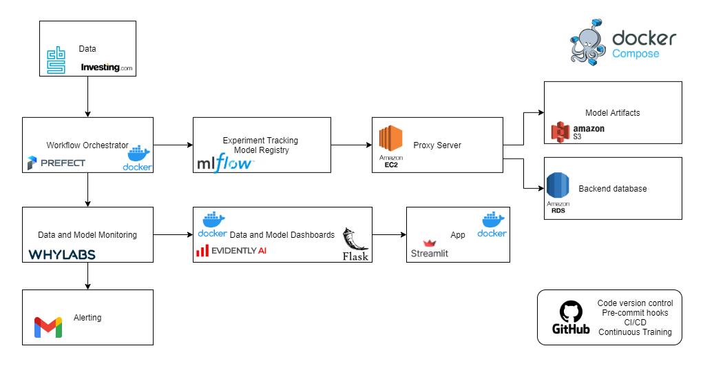

# MLOps for Dutch Fuel Price Prediction

## Introduction

In this MLOps project, Dutch fuel prices are predicted using time series forecasting techniques. The primary objective of this project is to demonstrate how a machine learning model can be deployed in a production environment. Various tools are used to enable the development, deployment, monitoring, and maintenance of machine learning models.

### Schematic Overview

The core components of this project include AWS services, Prefect, MLflow, Evidently, WhyLabs, Flask, Streamlit, Docker Compose, and GitHub Actions.

## Prediction and Data

The CBS (Central Statistical Office of the Netherlands) weekly updates the Dutch Eu95 fuel prices, which are accessible through its API. The oil price, which often precedes trends of the fuel price by a few days, is used as the main covariate. It uses the Brent Crude Oil price.

URL to both data sources:

* CBS Eu95 prices: https://www.cbs.nl/nl-nl/cijfers/detail/80416ned

* Worldwide oil prices: https://www.investing.com/commodities/brent-oil-historical-data

## MLOps Components

### AWS (Amazon Web Services)

AWS is used for cloud integration and provides essential infrastructure for the project:

- **EC2 (Elastic Compute Cloud)**: Acts as a proxy server for MLflow, facilitating model training, tracking, and management.
- **S3 (Simple Storage Service)**: Stores machine learning models and related artifacts, ensuring scalability and durability.
- **RDS (Relational Database Service)**: Manages metadata and other relevant data, facilitating efficient tracking and management of model experiments.

### Prefect

Prefect is used for workflow orchestration:

- **Workflow Management**: Orchestrates the entire data pipeline, including data collection, preprocessing, model training, and deployment.
- **Task Execution Time**: Prefect allows us to monitor and record how long each task takes to complete. This helps identify bottlenecks and optimize the workflow.
- **Task Failures**: When tasks fail, Prefect logs the failure details, including error messages and stack traces. This information is crucial for debugging and resolving issues promptly.
- **Task Logging**: We use Prefect's logging capabilities to capture task-specific information, such as input/output data, parameters, and custom logs. This aids in tracking task behavior and diagnosing problems.

### MLflow

MLflow is an open-source platform for the complete machine learning lifecycle:

- **Model Experimentation**: Provides an environment for experimenting with various machine learning algorithms and configurations.
- **Model Tracking**: Logs and tracks all model parameters, metrics, and artifacts for easy reproducibility.
- **Model Registry**: Offers a centralized repository to store, organize, and manage machine learning models.
- **Model Deployment**: Allows for easy deployment of models for inference, facilitating model serving.

### Evidently

Evidently is a tool for model monitoring and analysis:

- **Model Monitoring**: Continuously monitors model performance and data quality, alerting for any deviations or issues.
- **Data Visualization**: Generates insightful dashboards and visualizations to help understand model behavior and data patterns.
- **Model Explainability**: Provides explanations for model predictions, enhancing model transparency and interpretability.

### WhyLabs

WhyLabs is used for data monitoring and understanding:

- **Data Monitoring**: Tracks data quality, distribution, and anomalies, ensuring that input data remains consistent and reliable.
- **Data Profiling**: Generates detailed data profiles to help understand the characteristics and trends within the dataset.
- **Data Lineage**: Traces the flow and transformation of data through the entire pipeline for accountability and auditing.

### Flask

Flask is a lightweight web framework used to display Evidently dashboards:

- **Web Application**: Creates a web application to visualize Evidently dashboard insights and model performance.

### Streamlit

Streamlit is used to create an interactive web application:

- **Interactive App**: Develops a user-friendly web app for users to interact with and explore model predictions and insights.

### Docker Compose

Docker Compose is used to containerize the main application, Evidently, and Flask applications:

- **Containerization**: Ensures consistent and reproducible deployments by packaging applications and their dependencies into containers.
- **Deployment**: Simplifies deployment to various environments, making it easier to scale and manage the project.

### GitHub Actions

GitHub Actions is used for Continuous Integration/Continuous Deployment (CI/CD) and continuous training:

- **CI/CD Pipeline**: Automates the testing and deployment process, ensuring code quality and consistency.
- **Continuous Training**: Automates the retraining and deployment of models as new data becomes available.